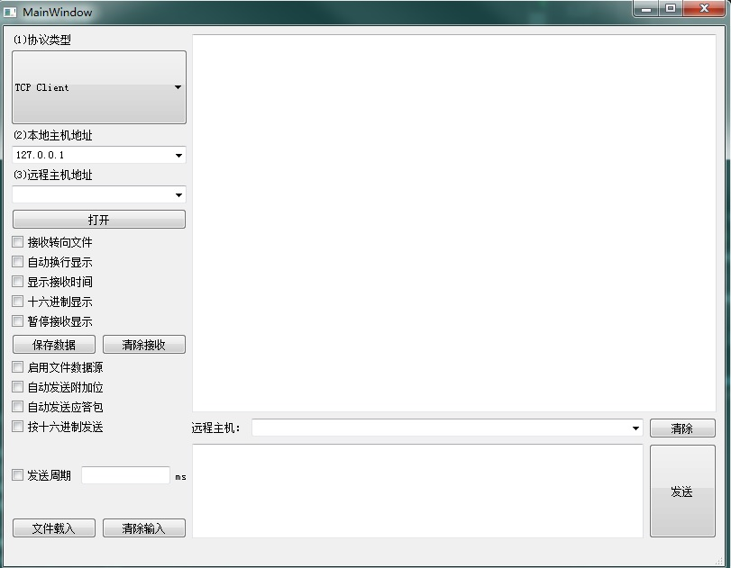

# NetAssistant 网络调试助手
跨平台网络调试助手

## 设计初衷
在TCP/UDP开发时经常需要有个网络调试助手进行辅助调试。庆幸的是Windows环境下有个比较好的网络调试助手（NetAssist 野人），但是Mac/Linux却没有。希望借助PyQt设计一个比较方便的网络调试助手，供TCP/UDP网络开发使用。

## 运行环境
Python3
PyQt5

## 功能说明
- UDP Client/Server 数据发送和接收
- TCP Client/Server 数据发送和接收
- 字符型/十六进制数据发送和显示
- 指定文件内容发送和接收转向文件

